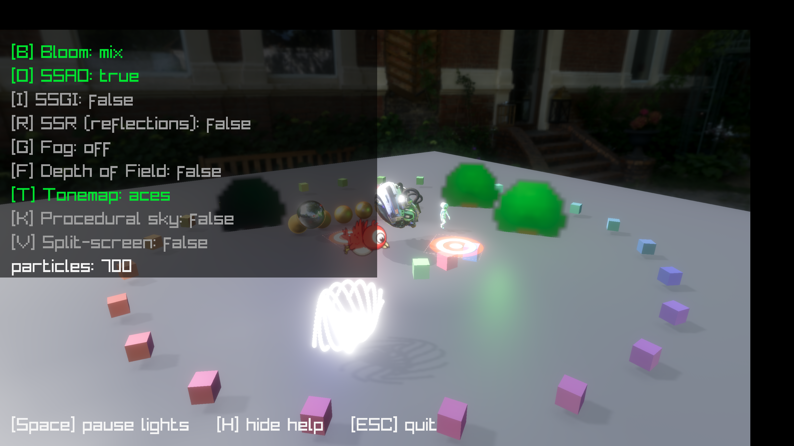
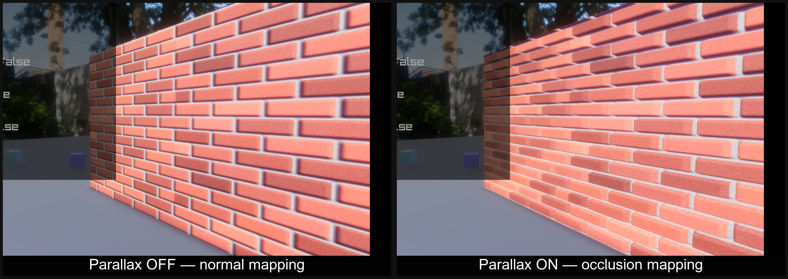

# r3d-go

A self-contained [cgo](https://pkg.go.dev/cmd/cgo) binding for
[R3D](https://github.com/Bigfoot71/r3d) — the 3D rendering extension for
[raylib](https://www.raylib.com/) — built from the
[r3dStarter](https://github.com/jensroth-git/r3dStarter) toolchain.

Targets: **macOS / arm64** (Apple Silicon) and **Windows / amd64** (MinGW-w64).
The native static libraries are vendored per platform under `lib/<goos>_<goarch>/`,
so a clone builds with no extra dependencies beyond a C toolchain (Xcode CLT on
macOS; a MinGW-w64 gcc such as [w64devkit](https://github.com/skeeto/w64devkit)
on Windows).



The `cmd/demo` showcase exercises most of R3D in one scene: HDR skybox + IBL, a
procedural sky, PBR models and primitives, a local reflection probe, skeletal
animation, GPU instancing, billboards, an animated sprite, projected decals, a
CPU particle system, transparent surfaces, a stencil outline, three light types
with shadows, optional split-screen multi-view, and the full post-processing
stack — bloom, SSAO, SSGI, SSR, fog, depth-of-field and tonemapping — toggled
live from the keyboard.

## Layout

```
r3d/
├── go.mod
├── Makefile             # build + ad-hoc codesign helper
├── r3d.go               # core: init, camera, lights, meshes, materials, instances, draw
├── material.go          # PBR material + texture maps (albedo/normal/emission/ORM), stencil/depth
├── model.go             # model loading, skeletal animation
├── environment.go       # skybox, cubemaps, IBL, procedural sky, post-processing (bloom/SSAO/SSGI/SSR/fog/DoF/tonemap)
├── camera.go            # R3D camera + multi-view (BeginPro, split-screen)
├── probe.go             # local reflection/illumination probes
├── decal.go             # projected decals
├── extra.go             # extra light controls, instance streaming, texture filtering
├── input.go             # raylib input, keys, colors, HUD helpers
├── math.go              # Vector3 / Quaternion helpers
├── raylib.go            # window, drawing, text, screenshot
├── cgo_darwin.go        # macOS link flags (Apple frameworks)  — //go:build darwin
├── cgo_windows.go       # Windows link flags (Win32 system libs) — //go:build windows
├── cmd/demo/main.go     # the feature showcase
├── assets/              # models (glb), HDR panorama, images
├── include/             # vendored public headers (raylib + r3d), shared by all platforms
└── lib/                 # vendored static archives, one dir per platform
    ├── darwin_arm64/    # Mach-O arm64 archives
    │   ├── libr3d.a     # R3D (shaders + lookup textures embedded at compile time)
    │   ├── libraylib.a  # raylib 5.5 (image formats PNG/HDR/JPG enabled — see below)
    │   └── libassimp.a  # Assimp (model loading)
    └── windows_amd64/   # PE/COFF (MinGW-w64) archives
        ├── libr3d.a
        ├── libraylib.a
        ├── libassimp.a
        └── libzlibstatic.a  # Assimp's static zlib (compressed model formats)
```

The C include paths are common to all platforms (`r3d.go`); the per-OS library
search paths and link flags live in the `cgo_<goos>.go` files, selected
automatically by Go build constraints. Adding another platform is: build the
three archives, drop them in a new `lib/<goos>_<goarch>/`, and add a
`cgo_<goos>.go` with the matching `#cgo LDFLAGS`.

## Build & run

**macOS:**
```bash
make run        # build, ad-hoc sign, run the showcase
# or
make demo       # build + sign -> ./r3ddemo
./r3ddemo       # interactive
```

**Windows** (with a MinGW-w64 gcc on `PATH`, e.g. w64devkit):
```bash
make run        # the Makefile detects Windows; no code signing needed
# or
go build -o r3ddemo.exe ./cmd/demo
./r3ddemo.exe   # interactive
```

Showcase controls: **B** bloom · **O** SSAO · **I** SSGI · **R** SSR · **G** fog ·
**F** depth-of-field · **T** tonemap · **K** procedural sky · **P** parallax wall ·
**V** split-screen · **Space** pause lights · **H** toggle help · **ESC** quit.

### Parallax mapping & UV mapping

UV mapping is native (per-vertex texcoords + material `uvScale`/`uvOffset`).
R3D has no built-in height/displacement map, but its **custom surface shaders**
expose everything needed for parallax-occlusion mapping in the fragment stage
(`TEXCOORD`, world `POSITION`, `TANGENT`/`BITANGENT`/`NORMAL`, custom samplers
and uniforms). The showcase ships a POM brick wall — `assets/shaders/parallax.glsl`
driven from Go via `LoadSurfaceShader` / `SetSampler` / `SetUniform*`:



> **MSAA + multi-view caveat.** Do not set `FlagMSAA4xHint` if you use
> `BeginPro` sub-viewports (split-screen): a multisampled backbuffer makes R3D's
> sub-viewport blit render black. R3D already anti-aliases at its internal
> resolution, so a multisampled backbuffer adds nothing — the showcase omits it.

## Things that bit us on macOS (and the fixes baked in)

1. **Code signing.** With cgo external linking the toolchain's ad-hoc signature
   can verify as invalid, and dyld kills the process at launch with *"Code
   Signature Invalid"* (SIGKILL, zero output). `make` re-signs ad-hoc after
   `go build` (`codesign --force --sign - r3ddemo`). Run that line yourself if
   you `go build`/`go run` by hand.

2. **Main thread.** raylib/GLFW drive Cocoa, which must run on the process main
   thread. Any program using this package must lock it:
   ```go
   import "runtime"
   func init() { runtime.LockOSThread() }
   ```

3. **Retina / HiDPI.** The GL drawable is 2× the logical window. The showcase
   sets `FlagWindowHighDPI` and initializes R3D at `GetRenderWidth()/Height()`
   so the deferred renderer fills the real framebuffer; 2D HUD font sizes are
   scaled by the DPI factor. (Note: `TakeScreenshot` must be called *after*
   `EndDrawing`, once the batched 2D HUD has been flushed.)

4. **Image formats.** r3dStarter builds raylib with image decoders disabled, so
   HDR skyboxes, PNG/JPG textures and embedded glTF textures fail to load. The
   vendored `libraylib.a` here was rebuilt with PNG/HDR/JPG/QOI enabled (see
   "Rebuilding" below).

## Linking

`r3d.go` carries the common cgo include paths; each OS supplies its own link
flags in a build-constrained file.

`cgo_darwin.go` (macOS / arm64):
```go
#cgo LDFLAGS: -L${SRCDIR}/lib/darwin_arm64 -lr3d -lraylib -lassimp -lc++ -lz -lm
#cgo LDFLAGS: -framework OpenGL -framework Cocoa -framework IOKit \
              -framework CoreFoundation -framework CoreVideo
```

`cgo_windows.go` (Windows / amd64, MinGW-w64): Apple frameworks become Win32
system libs, `-lc++` becomes `-lstdc++`, and zlib is the vendored
`libzlibstatic.a` (must follow `-lassimp`, which references it):
```go
#cgo LDFLAGS: -L${SRCDIR}/lib/windows_amd64 -lr3d -lraylib -lassimp -lzlibstatic
#cgo LDFLAGS: -lopengl32 -lgdi32 -lwinmm -luser32 -lshell32 -lstdc++ -lm
```

## API coverage

Idiomatic Go types (`Vector3`, `Color`, `Camera3D`, `Quaternion`…) and method
receivers (`Light.SetActive`, `Mesh.Unload`, `Material.SetRoughness`,
`InstanceBuffer.MapPositions`, `AnimationPlayer.Update`…). cgo includes the real
`raylib.h`/`r3d.h`, so extending the binding is mechanical — add a wrapper that
converts the value types and calls the matching `C.R3D_*` function. The full C
API lives in `include/r3d/`.

- **Core**: `Init`, `Close`, `Begin`, `End`
- **Window/raylib**: `InitWindow`, `WindowShouldClose`, `UpdateCamera`, input, `DrawText`, `DrawFPS`, `TakeScreenshot`, …
- **Lights**: dir/spot/omni, direction/position/color/energy/range, cones, soft shadows
- **Meshes**: `GenMeshSphere/Cube/Plane/Cylinder/Torus/Quad`
- **Materials (PBR)**: albedo/normal/emission/ORM maps, metalness/roughness/occlusion/specular, billboard/blend/transparency/cull modes, UV transform, unlit
- **Models + animation**: `LoadModel`, `DrawModel(Ex)`, `LoadAnimationLib`, `LoadAnimationPlayer`, `Play/SetLoop/SetSpeed/Update`, `DrawAnimatedModel(Ex)`
- **Skybox / IBL**: `LoadCubemap`, `GenAmbientMap`, `SetSky`, `SetAmbientMap`, background rotation/energy
- **Procedural sky**: `DefaultProceduralSky`, `SetSun`/`SetSkyColors`, `GenProceduralSky`
- **Reflection probes**: `CreateProbe`, position/range/falloff, `SetUpdateMode`
- **Instancing**: `LoadInstanceBuffer`, `MapPositions/Rotations/Scales/Colors`, `UploadPositions`, `DrawMeshInstanced`
- **Decals**: `NewDecal`, maps, `DrawDecal(Ex)`
- **Transparency / stencil**: material transparency/blend/cull modes, `SetStencil`, `SetDepthMode` (outline / x-ray)
- **UV mapping**: `Material.SetUVScale` / `SetUVOffset` (tiling/panning); meshes carry texcoords
- **Custom surface shaders**: `LoadSurfaceShader`, `SetUniformFloat/Int/Vec3`, `SetSampler`, `Material.SetShader` — e.g. parallax-occlusion mapping (`assets/shaders/parallax.glsl`)
- **Multi-view**: `CameraFromRL`, `BeginPro` with viewports (split-screen, minimaps)
- **Post-processing**: `SetBloom`, `SetSSAO`, `SetSSGI`, `SetSSIL`, `SetSSR`, `SetFog`, `SetDoF`, `SetTonemap`, `SetColorAdjustment`
- **Drawing**: `DrawMesh(Ex)`, environment background/ambient color

## Rebuilding the native archives

The vendored `.a` files were produced by building r3dStarter via CMake:

```bash
cmake -S r3dStarter -B build -DCMAKE_BUILD_TYPE=Release \
  -DCMAKE_OSX_ARCHITECTURES=arm64 \
  -DASSIMP_WARNINGS_AS_ERRORS=OFF \
  -DCMAKE_C_FLAGS="-Wno-error -include assert.h" \
  -DCMAKE_CXX_FLAGS="-Wno-error" \
  -DSUPPORT_FILEFORMAT_PNG=ON -DSUPPORT_FILEFORMAT_HDR=ON \
  -DSUPPORT_FILEFORMAT_JPG=ON -DSUPPORT_FILEFORMAT_QOI=ON
cmake --build build -j
# then copy build/lib/libr3d.a, the raylib/assimp archives, and the headers here
```

The non-default flags work around current Apple clang issues (Assimp's `-Werror`
on new warnings; raylib `rmodels.c` using `assert()` without `<assert.h>`) and
re-enable raylib's image decoders (PNG/HDR/JPG/QOI) that r3dStarter turns off.

### Windows / amd64 (MinGW-w64)

The Windows archives were built with the same [r3dStarter](https://github.com/jensroth-git/r3dStarter)
CMake project, using the **MinGW Makefiles** generator and the *same* MinGW-w64
gcc that cgo links with (here w64devkit's gcc 14.2.0 — do not mix MinGW
distributions, or Assimp's libstdc++ ABI won't match at link). Python 3 is
required (r3d embeds its shaders at configure time):

```sh
# PATH must contain ONLY w64devkit\bin, CMake\bin and Python — not git-bash's
# sh.exe (it breaks the MinGW Makefiles generator) nor any other gcc.
CC=gcc CXX=g++ cmake -S r3dStarter -B build -G "MinGW Makefiles" \
  -DCMAKE_BUILD_TYPE=Release \
  -DCMAKE_C_COMPILER=gcc.exe -DCMAKE_CXX_COMPILER=g++.exe \
  -DCMAKE_MAKE_PROGRAM=mingw32-make.exe \
  -DSUPPORT_FILEFORMAT_PNG=ON -DSUPPORT_FILEFORMAT_HDR=ON \
  -DSUPPORT_FILEFORMAT_JPG=ON -DSUPPORT_FILEFORMAT_QOI=ON \
  -DCMAKE_C_FLAGS="-Wno-error -Wno-implicit-function-declaration -include assert.h" \
  -DCMAKE_CXX_FLAGS="-Wno-error"
cmake --build build --target raylib r3d assimp -j
# copy build/lib/libr3d.a, build/_deps/raylib-build/raylib/libraylib.a,
# build/_deps/assimp-build/lib/libassimp.a and
# build/_deps/assimp-build/contrib/zlib/libzlibstatic.a into lib/windows_amd64/
```

The same `-include assert.h` raylib fix is needed; the template's own
`src/main.cpp` may fail to compile against newer R3D (`R3D_MapInstances`
signature drift) — that's only the example exe, the three libraries still build,
so build the library targets explicitly as above. If CMake reports a
*"Permission denied"* reading the compiler-id test exe, that's Windows Defender
locking the fresh binary — just re-run configure.
